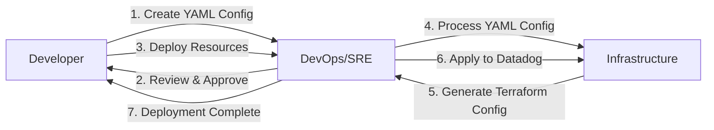

# Datadog Terraform Deployment Project

A developer-friendly Terraform project for deploying Datadog resources using YAML configuration. This project simplifies the process of setting up Datadog monitoring by providing pre-made templates and an easy-to-use CLI tool.

## Features

- 🚀 **Simple YAML Configuration**: Define your monitoring resources using simple YAML files
- 🛠️ **CLI Tool**: Easy-to-use command line interface for managing resources
- 📚 **Pre-made Templates**: Ready-to-use templates for common monitoring scenarios
- 🔄 **Environment Support**: Separate configurations for different environments
- ✅ **Validation**: Built-in configuration validation
- 📊 **Preview Changes**: See what changes will be made before applying

## Project Structure

```bash
project/
├── modules/                    # Terraform modules
│   ├── monitors/              # Monitor module
│   ├── dashboards/           # Dashboard module
│   └── slos/                 # SLO module
├── config/                    # YAML configurations
│   ├── prod/                 # Production environment
│   └── staging/              # Staging environment
├── examples/                  # Example configurations
│   ├── templates/            # Pre-made templates
│   │   ├── api-monitoring.yaml
│   │   └── database-monitoring.yaml
│   └── basic/               # Basic examples
├── scripts/                  # Helper scripts
│   └── datadog-tf-cli.py    # CLI tool
├── main.tf                   # Main Terraform configuration
└── variables.tf             # Global variables
```

## Development Flow



## Getting Started

1. **Install Dependencies**

```bash
# Install required Python packages
pip install click pyyaml

# Initialize Terraform
terraform init
```

1. **Create Configuration**

```bash
# Generate an API monitoring template
python scripts/datadog-tf-cli.py template monitor api-monitor.yaml
```

1. **Customize Settings**

```yaml
# api-monitor.yaml
monitors:
  api_latency:
    name: "API Latency Monitor"
    threshold: 1000
    tags:
      - "service:my-api"
      - "env:prod"
```

1. **Deploy Resources**

```bash
# Preview changes
python scripts/datadog-tf-cli.py plan api-monitor.yaml

# Apply changes
python scripts/datadog-tf-cli.py apply api-monitor.yaml
```

## Available Templates

We provide templates for common monitoring scenarios:

- **API Monitoring**: Latency, error rates, and endpoint performance
- **Database Monitoring**: Connection pools, query performance, and disk usage
- **Application Monitoring**: Memory usage, CPU utilization, and error rates
- **Infrastructure Monitoring**: Host metrics, container health, and network performance

## CLI Reference

```bash
# Generate a template
python scripts/datadog-tf-cli.py template <resource_type> <output_file>

# Validate configuration
python scripts/datadog-tf-cli.py validate <config_file>

# Preview changes
python scripts/datadog-tf-cli.py plan <config_file>

# Apply changes
python scripts/datadog-tf-cli.py apply <config_file>
```

## Best Practices

### Naming Conventions

- Use descriptive names
- Follow a consistent naming convention
- Include environment and service information

### Resource Tags

- Always include service, environment, and team tags
- Use consistent tag formats
- Follow your organization's tagging policy

### Monitoring Setup

- Start with conservative thresholds
- Adjust based on historical data
- Include proper alert messages with clear actions

### Version Control

- Version control your configurations
- Review changes before applying
- Maintain separate environments

## Contributing

1. Fork the repository
1. Create a feature branch
1. Make your changes
1. Submit a pull request

## Support

1. Check the examples directory
1. Review the documentation
1. Open an issue in the repository

## License

MIT License

   ```

2. **Dashboard Configuration**
   ```yaml
   dashboards:
     <dashboard_name>:
       title: "Dashboard Title"
       description: "Dashboard Description"
       widgets:
         - type: "timeseries"
           title: "CPU Usage"
           query: "avg:system.cpu.user{service:my-app}"
   ```

3. **SLO Configuration**
   ```yaml
   slos:
     <slo_name>:
       name: "Service Availability"
       target: 99.9
       timeframe: "30d"
       tags:
         - "service:my-app"
   ```

## For DevOps/SRE

### Module Management

1. **Adding New Templates**
   - Create new template in appropriate module
   - Add validation rules in variables.tf
   | Update documentation
   - Add example configuration

2. **Best Practices**
   - Use consistent naming conventions
   - Include proper validation
   - Add comprehensive documentation
   - Include example configurations

### Maintenance

1. **Regular Tasks**
   - Review and update templates
   - Update documentation
   - Monitor resource usage
   - Review and update thresholds

2. **Version Control**
   - Use semantic versioning
   - Maintain changelog
   - Tag releases

## Best Practices

1. **Configuration**
   - Use meaningful names
   - Include all required tags
   - Set appropriate thresholds
   - Document special requirements

2. **Resource Management**
   - Follow naming conventions
   - Use consistent tagging
   - Set appropriate thresholds
   - Include proper documentation

3. **Security**
   - Use environment variables for secrets
   - Follow least privilege principle
   - Regular security reviews

## Contributing

1. Fork the repository
2. Create a feature branch
3. Make your changes
4. Submit a pull request

## Support

For support, please [contact details or issue tracker information]

## License

MIT License

Copyright (c) 2024 [Your Name or Organization]

Permission is hereby granted, free of charge, to any person obtaining a copy
of this software and associated documentation files (the "Software"), to deal
in the Software without restriction, including without limitation the rights
to use, copy, modify, merge, publish, distribute, sublicense, and/or sell
copies of the Software, and to permit persons to whom the Software is
furnished to do so, subject to the following conditions:

The above copyright notice and this permission notice shall be included in all
copies or substantial portions of the Software.

THE SOFTWARE IS PROVIDED "AS IS", WITHOUT WARRANTY OF ANY KIND, EXPRESS OR
IMPLIED, INCLUDING BUT NOT LIMITED TO THE WARRANTIES OF MERCHANTABILITY,
FITNESS FOR A PARTICULAR PURPOSE AND NONINFRINGEMENT. IN NO EVENT SHALL THE
AUTHORS OR COPYRIGHT HOLDERS BE LIABLE FOR ANY CLAIM, DAMAGES OR OTHER
LIABILITY, WHETHER IN AN ACTION OF CONTRACT, TORT OR OTHERWISE, ARISING FROM,
OUT OF OR IN CONNECTION WITH THE SOFTWARE OR THE USE OR OTHER DEALINGS IN THE
SOFTWARE.