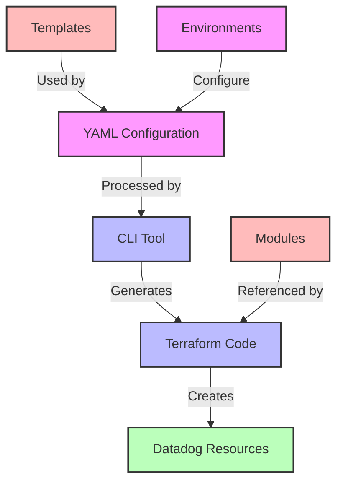
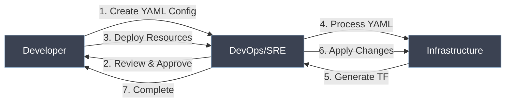
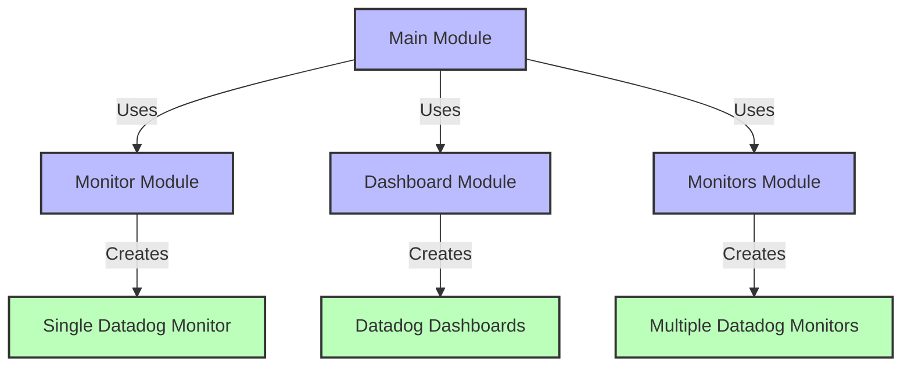

# Datadog Terraform Deployment Project

A developer-friendly Terraform project for deploying Datadog resources using YAML configuration. This project simplifies the process of setting up Datadog monitoring by providing pre-made templates and an easy-to-use CLI tool, designed specifically for DevOps and SRE professionals.

## 🌟 Key Features

- 🚀 **Simple YAML Configuration**: Define your monitoring resources using simple YAML files
- 🛠️ **CLI Tool**: Easy-to-use command line interface for managing resources
- 📚 **Pre-made Templates**: Ready-to-use templates for common monitoring scenarios
- 🔄 **Environment Support**: Separate configurations for different environments
- ✅ **Validation**: Built-in configuration validation
- 📊 **Preview Changes**: See what changes will be made before applying

## 📋 Table of Contents

- [Architecture Overview](#architecture-overview)
- [Project Structure](#project-structure)
- [Quick Start Guide](#quick-start-guide)
- [Workflow](#workflow)
- [Available Templates](#available-templates)
- [CLI Reference](#cli-reference)
- [Best Practices](#best-practices)
- [Configuration Examples](#configuration-examples)
- [Developer Guidelines](#developer-guidelines)
- [Contributing](#contributing)
- [Support](#support)
- [License](#license)

## 🏗️ Architecture Overview

The project uses a modular approach to manage Datadog resources through Terraform, with YAML as the primary configuration interface.



## 📁 Project Structure

```shell
project/
├── modules/                    # Terraform modules
│   ├── monitor/               # Monitor module
│   ├── monitors/              # Multiple monitors module
│   └── dashboard/             # Dashboard module
├── config/                    # YAML configurations
│   └── developer-input.yaml   # Example developer input
├── docs/                      # Documentation
│   ├── HOW_TO_CREATE_NEW_MODULE.md
│   └── USAGE_GUIDE.md
├── environments/              # Environment-specific configurations
│   ├── dev/                   # Development environment
│   └── prod/                  # Production environment
├── examples/                  # Example configurations
│   ├── templates/             # Pre-made templates
│   │   ├── api-monitoring.yaml
│   │   └── database-monitoring.yaml
│   ├── dashboard/             # Dashboard examples
│   └── monitor/               # Monitor examples
├── scripts/                   # Helper scripts
│   ├── create-resource.sh     # Resource creation script
│   └── datadog-tf-cli.py      # CLI tool
├── main.tf                    # Main Terraform configuration
├── variables.tf               # Global variables
└── terraform.tfvars.example   # Example Terraform variables
```

## 🚀 Quick Start Guide

### Prerequisites

- Terraform ≥ 1.0.0
- Python 3.6+
- Datadog API and App keys

### Installation

1. **Clone the repository**

```shell
git clone https://github.com/yourusername/datadog-tf-deploy.git
cd datadog-tf-deploy
```

2. **Install dependencies**

```shell
# Install required Python packages
pip install click pyyaml

# Initialize Terraform
terraform init
```

3. **Configure Datadog credentials**

Create a `terraform.tfvars` file with your Datadog API credentials:

```hcl
datadog_api_key = "your-api-key"
datadog_app_key = "your-app-key"
datadog_api_url = "https://api.datadoghq.com/"
```

### Creating Your First Monitor

1. **Generate a template**

```shell
# Generate an API monitoring template
python scripts/datadog-tf-cli.py template monitor api-monitor.yaml
```

2. **Customize the configuration**

```yaml
# api-monitor.yaml
monitors:
  api_latency:
    name: "API Latency Monitor"
    type: "metric alert"
    query: "avg(last_5m):avg:trace.http.request.duration{service:my-api} > 1000"
    message: "API latency is above threshold of 1000ms"
    threshold: 1000
    tags:
      - "service:my-api"
      - "env:prod"
      - "team:backend"
```

3. **Validate your configuration**

```shell
python scripts/datadog-tf-cli.py validate api-monitor.yaml
```

4. **Preview and deploy**

```shell
# Preview changes
python scripts/datadog-tf-cli.py plan api-monitor.yaml

# Apply changes
python scripts/datadog-tf-cli.py apply api-monitor.yaml
```

## 🔄 Workflow

The typical workflow for deploying Datadog resources:

```mermaid
graph LR
    A[Select Template] -->|Customize| B[Edit YAML]
    B -->|Validate| C[Run CLI Validate]
    C -->|Preview| D[Run CLI Plan]
    D -->|Deploy| E[Run CLI Apply]
    E -->|Monitor| F[Datadog Dashboard]

    classDef start fill:#f96,stroke:#333,stroke-width:2px;
    classDef process fill:#bbf,stroke:#333,stroke-width:2px;
    classDef end fill:#9f6,stroke:#333,stroke-width:2px;
    
    class A start;
    class B,C,D process;
    class E,F end;
```

### Team Collaboration Workflow



## 📚 Available Templates

We provide templates for common monitoring scenarios:

| Template | Description | Use Case |
|----------|-------------|----------|
| **API Monitoring** | Monitors for API endpoints | Latency, error rates, and endpoint performance |
| **Database Monitoring** | Monitors for database systems | Connection pools, query performance, and disk usage |
| **Application Monitoring** | Monitors for application health | Memory usage, CPU utilization, and error rates |
| **Infrastructure Monitoring** | Monitors for infrastructure | Host metrics, container health, and network performance |

## 🛠️ CLI Reference

The CLI tool provides several commands to manage your Datadog resources:

```shell
# Generate a template
python scripts/datadog-tf-cli.py template <resource_type> <output_file>

# Validate configuration
python scripts/datadog-tf-cli.py validate <config_file>

# Preview changes
python scripts/datadog-tf-cli.py plan <config_file>

# Apply changes
python scripts/datadog-tf-cli.py apply <config_file>
```

## 📋 Best Practices

### Resource Configuration

- Use descriptive names
- Follow a consistent naming convention: `[env]-[team]-[service]-[resource-type]`
- Include environment and service information

### Tag Standards

- Always include service, environment, and team tags
- Use consistent tag formats
- Follow your organization's tagging policy

### Alert Management

- Start with conservative thresholds
- Adjust based on historical data
- Include proper alert messages with clear actions

### Code Management

- Version control your configurations
- Review changes before applying
- Maintain separate environments

## 📝 Configuration Examples

### Monitor Setup

```yaml
monitors:
  api_latency:
    name: "API Latency Monitor"
    type: "metric alert"
    query: "avg(last_5m):avg:trace.http.request.duration{service:my-api} > 1000"
    message: |
      API latency is above threshold of 1000ms
      @slack-your-channel @pagerduty-service
    threshold: 1000
    tags:
      - "service:my-api"
      - "env:prod"
      - "team:backend"
```

### Dashboard Setup

```yaml
dashboards:
  service_dashboard:
    title: "Service Dashboard"
    description: "Overview of service performance"
    widgets:
      - type: "timeseries"
        title: "CPU Usage"
        query: "avg:system.cpu.user{service:my-app}"
      - type: "timeseries"
        title: "Memory Usage"
        query: "avg:system.mem.used{service:my-app}"
```

### SLO Setup

```yaml
slos:
  service_availability:
    name: "Service Availability"
    target: 99.9
    timeframe: "30d"
    tags:
      - "service:my-app"
```

## 👨‍💻 Developer Guidelines

### Module Relationships



### Module Setup

1. Create new template in appropriate module
2. Add validation rules in variables.tf
3. Update documentation
4. Add example configuration

### Best Practices

- Use consistent naming conventions
- Include proper validation
- Add comprehensive documentation
- Include example configurations

### Repository Tasks

1. **Regular Updates**
   - Review and update templates
   - Update documentation
   - Monitor for deprecated features
   - Review and update thresholds

2. **Repository Management**
   - Regular commits
   - Pull request reviews
   - Release management
   - Tag releases

## 🤝 Contributing

We welcome contributions to improve this project!

1. Fork the repository
2. Create a feature branch
3. Make your changes
4. Submit a pull request

Please see our [Contributing Guidelines](CONTRIBUTING.md) for more details.

## 🆘 Support

For support, please:

1. Check the examples directory
2. Review the documentation
3. [Create an issue](https://github.com/yourusername/datadog-tf-deploy/issues)

## 📄 License

MIT License

Copyright (c) 2024

Permission is hereby granted, free of charge, to any person obtaining a copy
of this software and associated documentation files (the "Software"), to deal
in the Software without restriction, including without limitation the rights
to use, copy, modify, merge, publish, distribute, sublicense, and/or sell
copies of the Software, and to permit persons to whom the Software is
furnished to do so, subject to the following conditions:

The above copyright notice and this permission notice shall be included in all
copies or substantial portions of the Software.

THE SOFTWARE IS PROVIDED "AS IS", WITHOUT WARRANTY OF ANY KIND, EXPRESS OR
IMPLIED, INCLUDING BUT NOT LIMITED TO THE WARRANTIES OF MERCHANTABILITY,
FITNESS FOR A PARTICULAR PURPOSE AND NONINFRINGEMENT. IN NO EVENT SHALL THE
AUTHORS OR COPYRIGHT HOLDERS BE LIABLE FOR ANY CLAIM, DAMAGES OR OTHER
LIABILITY, WHETHER IN AN ACTION OF CONTRACT, TORT OR OTHERWISE, ARISING FROM,
OUT OF OR IN CONNECTION WITH THE SOFTWARE OR THE USE OR OTHER DEALINGS IN THE
SOFTWARE.
